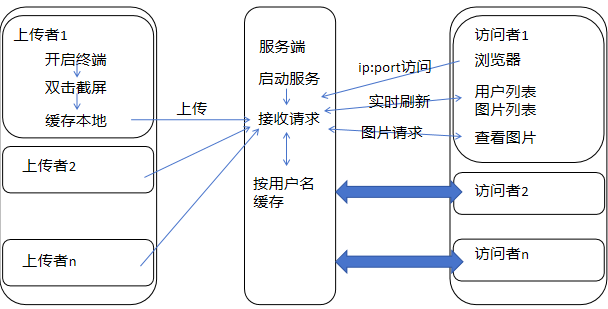

## 场景

多个上传者->服务器<-多个访问者



## 服务端

serve文件夹下

运行 main.exe文件

或者 在cmd窗口中输入
```sh
python flasker.py
```

## 客户端

client文件夹下

运行 doing-together.exe运行即可, 操作详见《使用说明》

源文件为main.py

## 访问者

浏览器 输入服务端的 ip:port

